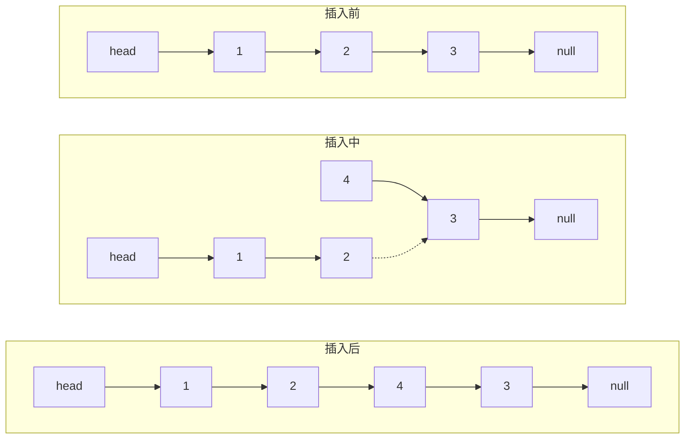
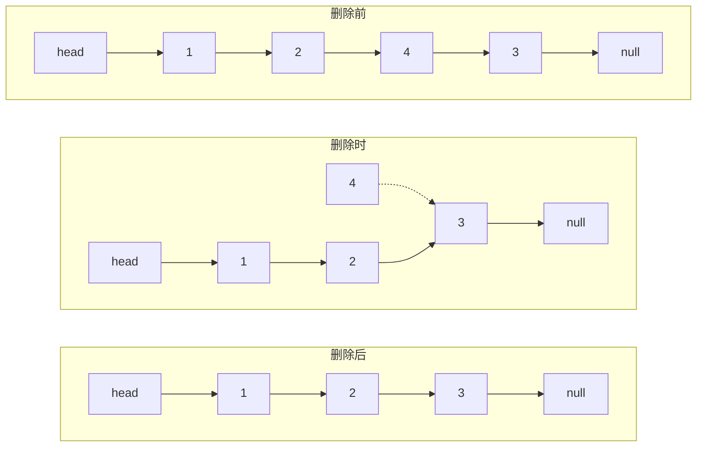

# 链表

> 本笔记主要记链表的操作注意事项，以及一些思想
> 
> 其中包含的思想一般有：面向过程，面向对象，面向接口，备份，先引后整，虚拟对象

## 数据结构的一些共性

- 抽象出数据结构的一些共性，显然有数据集和操作集；
  - 数据集可以理解为静态的逻辑结构
  - 操作集可以理解为动态的逻辑结构
- 数据集与设计的结构有关，步骤应该如下：
  - 一般是先有 目的/需求
  - 然后再从逻辑结构上设计一个数据结构与之匹配
  - 最后再将这个逻辑结构用 代码/物理结构 表达出来
- 操作集一般有以下几种：
  - 常见的有增删改查
  - 以及初始化等操作

先理解被设计的数据结构本身，再去理解其中的原理

***

## 链表的操作

#### 1.插入

在**插入**这一步的过程中，从面向对象的视角来看这个逻辑结构，主要涉及：

- **面向对象**的视角来看这个逻辑结构：
  要处理的对象：链表本身(长度+1)，被指向的老节点(修改指向)，新插入的结点

- **面向过程**的视角：
  先处理新结点，再处理老结点:



- **面向接口**视角：
  向**插入函数**传入*链表，位置，值*，返回插入后的链表

> 由此观之，面向过程更注重逻辑结构的细节，面向对象和面向接口则更注重于宏观整体

##### 先引入后整合：

> ```C
> static int insertPosLinkList(LNode* pre, element_t val) {
>     LNode* node = (LNode*)malloc(sizeof(LNode));
>     if (node == NULL) {
>         return 0;
>     }
>     node->data = val;
>     node->next = pre->next;
>     pre->next = node;
>     return 1;
> }
> ```

- 这体现了**先引入，后整合**的思想，即**先将新事物引入原有的环境，再略微调整受影响的部分**，这样在引入的过程中，**能确保这是在原有版本的基础上引入的，在引入时保留原版本的所有信息量**，保证引入后和原版本合为一体，最后再补丁原版本在引入后的变化
  *老节点在逻辑结构上很脆弱(先改动后容易丢失数据)* ---- 原有环境需要尽可能稳定
  
  >  这好比项目开发中，先引入新的功能，再和原版本进行整合

***

#### 2.删除

- **面向对象**的视角来看这个逻辑结构：
  要处理的对象：链表本身(长度-1)，被指向的老节点(修改指向)，新插入的结点

- **面向过程**的视角：




- **面向接口**视角：
  向**删除函数**传入*链表，位置*，返回删除后的链表

**删除要用前驱结点，而且要备份结点，有时候还要虚拟结点**：

###### 备份

- **备份**的原因：本质上是为了防止数据的丢失，**面向接口**中传参后，可能传入的是指针形式的链表（如头指针，这时需要备份这个传参，**以保证原环境不受影响**(防止指针丢失，错误修改 等操作 对原环境的影响)，**但备份后不用担心外部的环境受到影响**

###### 虚拟对象

- **虚拟结点**的原因:应用在链表中时本质上是在栈空间引入一个变量让**删除**操作统一化（如当传入的不是结结点，而仅仅是指针，传统来讲需要用个if来判断这是否为头）。
  
  ```C
  //引入dummy虚拟指针以完成带头指针链表的删除
  struct ListNode* reverseList(struct ListNode* head) {
      struct ListNode dummy;
      dummy.next = NULL;
      struct ListNode* tmp;
      while (head) {
          tmp = head->next;
          head->next = dummy.next;
          dummy.next = head;
          head = tmp;
          return dummy.next;
      }
  }
  ```
  
  **虚拟节点**往更广泛的说可以是**虚拟对象**
  **虚拟对象**的应用：**引入合适的对象**，以进行**统一化的操作**。

> 在LeetCode 206 中便可以用这一思想

***

#### 3.改和查

这里的改和查都挺简单，都是先找到一个元素，然后对其进行操作

***

## 通用逻辑

- 增删改查在逻辑本质上都具有一个共性：**都需要先找一个元素，然后对其进行操作**

- 但这里的**找**有一个特点：**找到的元素必须是目标的前驱**
  原因：**单向链表中 *单向性* 这一属性**(面向对象)
  
  > ```C
  > static int deleteLinkList(LNode* pre) {
  >     LNode* temp = pre->next;
  >     pre->next = pre->next->next;
  >     if (pre->next) {
  >         free(temp);
  >         return 1;
  >     }
  >     return 0;
  > }
  > ```
  > 
  > 当传入的是pre时，不难理解，当目标被删除前，直接把pre连到目标的后继即可。
  > 但如果此时传入的是目标结点，我们就没法对前驱进行连接操作了
  
  这如同一个人走在桥上，他只能**向前走**和**向前看**，**而无法访问走过的路**
  
  

## 总结

所包含的思想：

- 面向对象（**对象和属性**）
- 面向接口（**外部环境，内部环境的约束**）
- 面向过程（**逻辑结构具体行为的实现**）
- 备份（**防止修改外部数据，防止数据丢失**(如堆指针丢失导致的内存泄露)）
- 虚拟对象（**引入合适的对象，对 数据/结构 进行统一化操作**）
- 先引入后整合（**保证在引入时原环境的信息量不变**）

***


###### 补充遗忘的基础知识

- 指针类型必须要初始化，否则会报错

- 注意程序最后的返回代码
